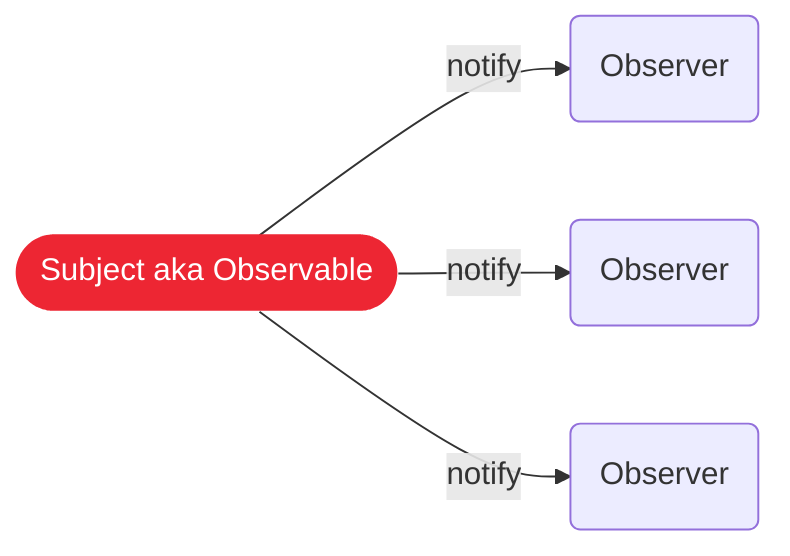
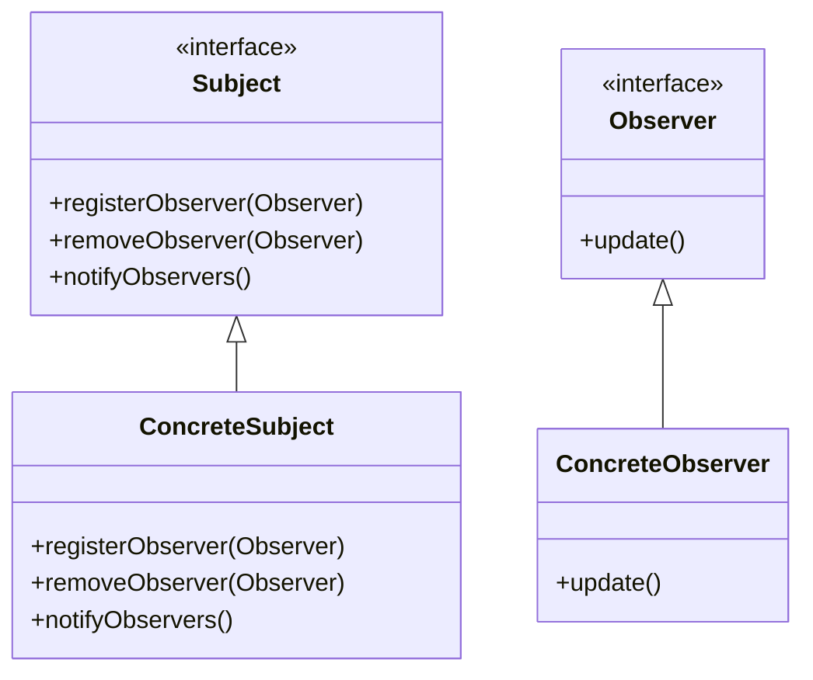

# Observer Design Pattern

```mermaid
graph LR

classDef topic fill:#ed2633,stroke-width:0,color:#fff;

A([Subject aka Observable]):::topic
A -->|notify| B(Observer)
A -->|notify| C(Observer)
A -->|notify| D(Observer)
```

## Class Diagram

```mermaid
classDiagram
    Subject <|-- ConcreteSubject
    Observer <|-- ConcreteObserver

    class Subject {
        <<interface>>
        +registerObserver(Observer)
        +removeObserver(Observer)
        +notifyObservers()
    }

    class ConcreteSubject {
        +registerObserver(Observer)
        +removeObserver(Observer)
        +notifyObservers()
    }

    class Observer {
        <<interface>>
        +update()
    }

    class ConcreteObserver {
        +update()
    }

```
