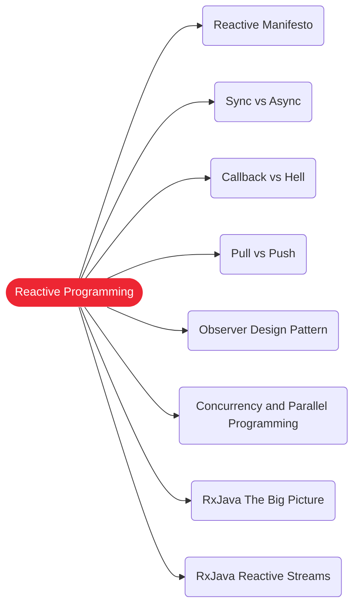

# Reactive Programming Introduction

```mermaid
graph LR

classDef topic fill:#ed2633,stroke-width:0,color:#fff;

A([Reactive Programming]):::topic
A --> B(Reactive Manifesto)
A --> C(Sync vs Async)
A --> D(Callback vs Hell)
A --> E(Pull vs Push)
A --> F(Observer Design Pattern)
A --> G(Concurrency and Parallel Programming)
A --> H(RxJava The Big Picture)
A --> I(RxJava Reactive Streams)
```

## [Reactive Manifesto](ReactiveManifesto.md)

## [Observer Design Pattern](ObserverPattern.md)
