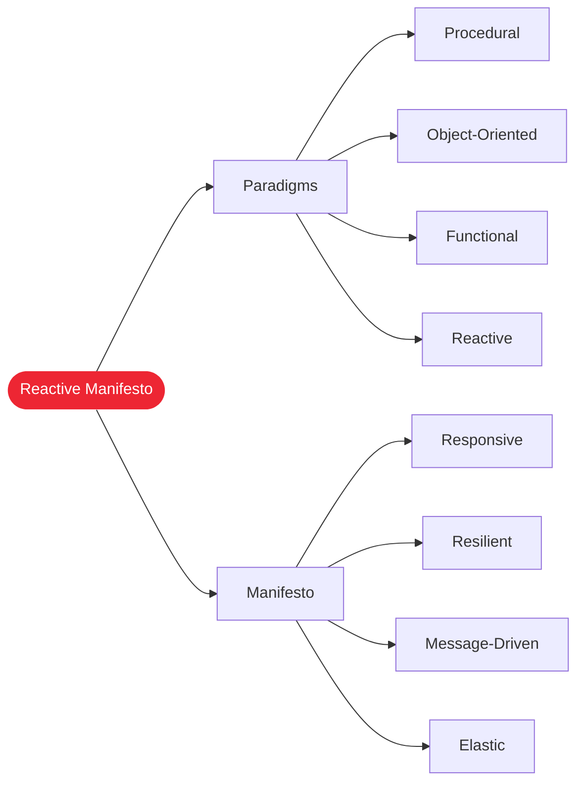

# Reactive Programming Introduction

```mermaid
graph LR

classDef topic fill:#ed2633,stroke-width:0,color:#fff;

A([Reactive Manifesto]):::topic
    A --> Paradigms
        Paradigms --> Procedural
        Paradigms --> Object-Oriented
        Paradigms --> Functional
        Paradigms --> Reactive
    A --> Manifesto
        Manifesto --> Responsive
        Manifesto --> Resilient
        Manifesto --> Message-Driven
        Manifesto --> Elastic
```

## The Manifesto

[https://reactivemanifesto.org](https://reactivemanifesto.org)
